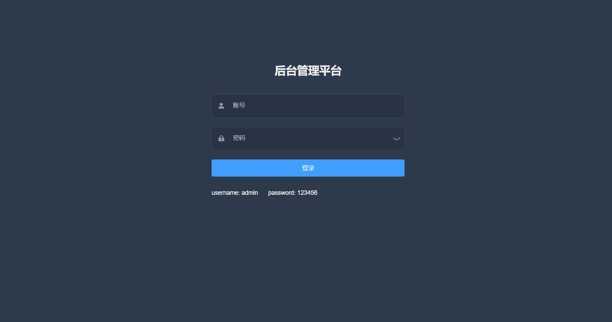
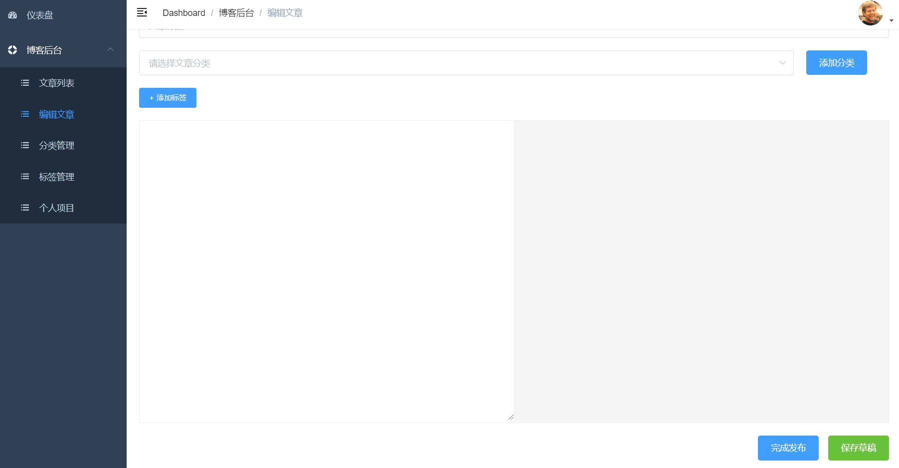
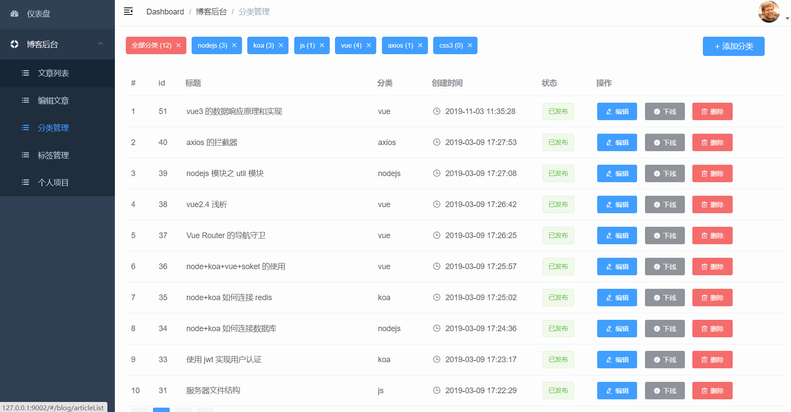
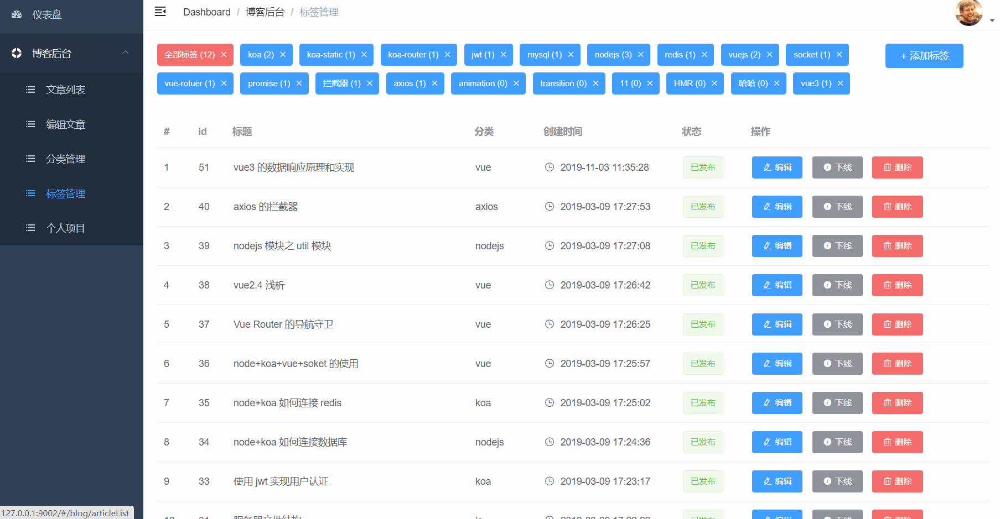
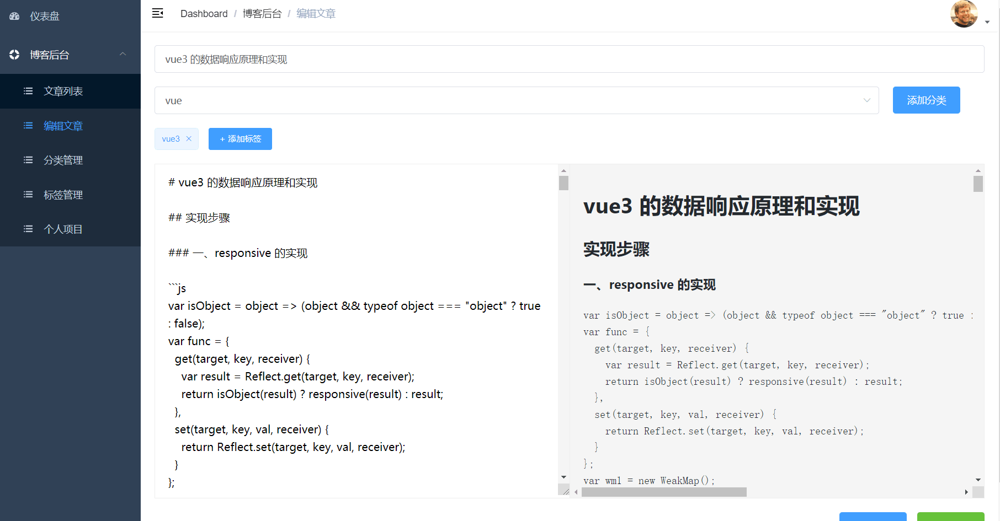

# vue-blog 后台管理系统

---

## 技术栈

1. vue/vue-router/vuex/webpack4
2. koa
3. mysql
4. redis
5. websocket

## 版本

`v2.0`

## 更新记录

1. 2019-03-16
   - 增加 github 授权认证
2. 2019-03-24
   - 增加留言功能
3. 2019-03-31
   - 帐号登录时前端密码加密
4. 2019-06-02
   - 升级到 vue-cli3
   - 优化页面
   - 修复已知的 bug
   - 增加了 vuex 状态管理

## 完成的功能

- v1.x
  1. 登录页面
  2. 文章列表，文章的编辑，发布，下线，socket 实时保存
  3. 新增文章编辑
  4. 分类列表，分类的删除，编辑，新增
  5. 标签列表，标签的删除，编辑，新增
  6. 项目列表，项目的删除，编辑，新增
  7. 留言板与 github 认证
- v2.x
  1. 项目升级到 vue-cli3

### 待完成的功能

1. ~~github 认证~~
2. ~~评论管理~~
3. 编辑器的优化
4. 首页增加可视化图表
5. 获取用户位置
6. 留言管理功能
7. ...

## 注意事项

1. vue.socket.io 版本必须是`^2.1.1-a`
2. 安装 mysql，用 `navicat` 连接 mysql，导入项目中 sql 文件，`my_vue_blog` 是有数据和结构的文件，`my_vue_blog2` 是只有结构，注意数据库名字和数据库登录的帐号密码
3. 安装 redis, 用 `RedisDesktopManager` 连接 redis，前提是开启了 redis 服务（如果配置环境变量，则 cmd 中输入 `redis-server`，否则进入 redis 安装的目录里输入 `redis-server.exe` `redis.windows.conf`）
4. 登录帐号是 `admin/123456`

## 常见问题

```
1. Warning: no config file specified, using the default config. In order to specify a config file use redis-server.exe /path/to/redis.conf

解决方法：在redis目录下输入redis-server.exe  redis.windows.conf

2. Creating Server TCP listening socket 127.0.0.1:6379: bind: No error

解决方法：
在redis目录下输入
redis-cli.exe
shutdown
exit
然后重新运行redis-server.exe redis.windows.conf

```

## 如何使用

1. npm install
2. npm run redis
3. npm run server
4. npm run dev

## 目录

```txt
├─public  # 静态页面
├─server  # 服务端
│  ├─api  # 前台/后台的接口
│  │  ├─admin
│  │  ├─oauth
│  │  ├─post
│  │  └─track
│  ├─config # 配置文件
│  │  ├─environment
│  │  └─src # 上传的图片
│  │      ├─tempUploads
│  │      └─uploads
│  │          ├─20190226
│  │          ├─20190228
│  │          ├─20190309
│  │          └─20190602
│  ├─middlreware # 一些中间件
│  ├─routes # 后端路由
│  └─util # 公共方法
└─src # 后台代码
    ├─api # resetful API
    │  └─restfulApi
    ├─assets # 静态文件夹
    ├─common # 公共的代码
    │  ├─images
    │  ├─scripts
    │  └─styles
    ├─components # 组件
    │  ├─header
    │  ├─menu
    │  ├─message
    │  └─messageBox
    ├─config # 配置文件
    ├─router # 路由
    ├─store  # vuex
    └─views  # 页面
        ├─404 # 404
        ├─category # 分类
        ├─edit # 编辑
        ├─home # 首页
        ├─itemlist # 个人项目
        ├─login # 登录页
        ├─musiclist # 空文件夹
        ├─postlist # 文章列表
        └─tag # 标签列表
```

## 关键技术点

1. [nodejs 熟悉,http,fs,path,Buffer 的使用](https://github.com/dirkhe1051931999/hjBlog/blob/master/blog-management/lessons/01.md)
2. [koa 的原理与 koa-static、koa-router 等中间件的实现](https://github.com/dirkhe1051931999/hjBlog/blob/master/blog-management/lessons/02.md)
3. [服务器目录，API 接口管理](https://github.com/dirkhe1051931999/hjBlog/blob/master/blog-management/lessons/03.md)
4. [使用 koa-session 实现用户认证](https://github.com/dirkhe1051931999/hjBlog/blob/master/blog-management/lessons/04.md)
5. [使用 jwt 实现用户认证](https://github.com/dirkhe1051931999/hjBlog/blob/master/blog-management/lessons/05.md)
6. [node+koa 如何连接数据库](https://github.com/dirkhe1051931999/hjBlog/blob/master/blog-management/lessons/06.md)
7. [node+koa 如何连接 redis，mysql 和 redis 联调](https://github.com/dirkhe1051931999/hjBlog/blob/master/blog-management/lessons/07.md)
8. [node+koa+vue+soket 的使用](https://github.com/dirkhe1051931999/hjBlog/blob/master/blog-management/lessons/08.md)
9. [node+koa 的文章的增删改查及文章的表结构](https://github.com/dirkhe1051931999/hjBlog/blob/master/blog-management/lessons/09.md)
10. [node+koa 分类的增删改查及分类的表结构](https://github.com/dirkhe1051931999/hjBlog/blob/master/blog-management/lessons/10.md)
11. [node+koa 标签的增删改查及标签的表结构](https://github.com/dirkhe1051931999/hjBlog/blob/master/blog-management/lessons/11.md)
12. [node+koa 项目的增删改查及项目的表结构](https://github.com/dirkhe1051931999/hjBlog/blob/master/blog-management/lessons/12.md)
13. [node+koa 图片的上传、form 标签的处理和静态服务器](https://github.com/dirkhe1051931999/hjBlog/blob/master/blog-management/lessons/13.md)
14. [vue 实现全局的组件、分页组件](https://github.com/dirkhe1051931999/hjBlog/blob/master/blog-management/lessons/14.md)
15. [vue+koa 实现 github 登录授权](https://github.com/dirkhe1051931999/hjBlog/blob/master/blog-management/lessons/15.md)
16. [留言功能](https://github.com/dirkhe1051931999/hjBlog/blob/master/blog-management/lessons/16.md)
17. [vue 组件通信](https://github.com/dirkhe1051931999/hjBlog/blob/master/blog-vue/lessons/06.md)
18. [vue-cli3.x 的配置文件详细介绍](https://github.com/dirkhe1051931999/hjBlog/tree/master/blog-vue/lessons/11.md)
19. [rem 与 em](https://github.com/dirkhe1051931999/hjBlog/blob/master/blog-css/lessons/03.md)
20. [webpack 优化相关](https://github.com/dirkhe1051931999/common-demo/tree/master/webpack-study-notes)

## 实现效果

- 
- 
- 
- 
- 
- 
- 
- 

## 其他

> MIT
